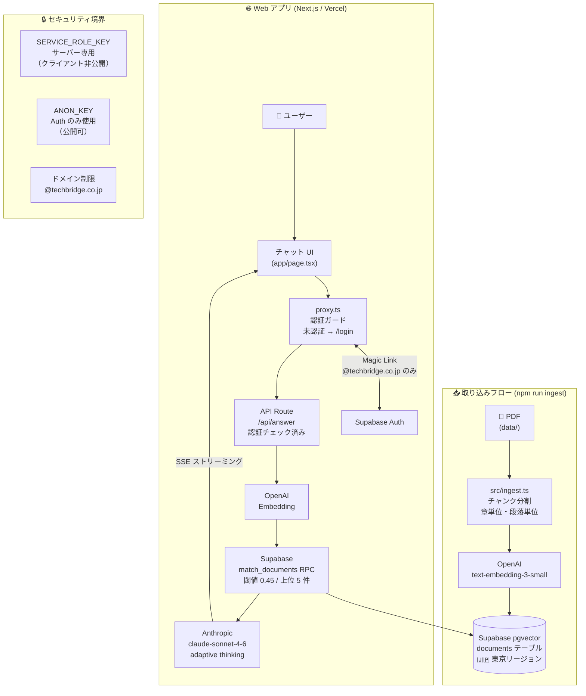

# 社内文書検索AI（RAG）

## システム概要

社内規則・各種マニュアルを PDF として取り込み、自然言語の質問に対して関連箇所を引用しながら回答する RAG（Retrieval-Augmented Generation）システムです。

- **取り込み**: PDF をチャンク分割 → OpenAI でベクトル化 → Supabase（pgvector）に保存
- **回答**: 質問をベクトル化 → 類似文書を検索 → Claude がストリーミング回答
- **UI**: Next.js チャット画面（マジックリンク認証付き）

---

## アーキテクチャ図



**外部サービス接続点**

| サービス | 用途 | キー種別 |
|---|---|---|
| OpenAI (`text-embedding-3-small`) | テキスト → ベクトル変換 | `OPENAI_API_KEY`（サーバー専用） |
| Anthropic (`claude-sonnet-4-6`) | 回答生成（ストリーミング） | `ANTHROPIC_API_KEY`（サーバー専用） |
| Supabase pgvector | ベクトルストア・類似検索 | `SERVICE_ROLE_KEY` / `ANON_KEY` |
| Supabase Auth | マジックリンク認証 | `ANON_KEY`（公開可） |

---

## 運用手順書

### 新しい PDF を追加する手順

```bash
# 1. data/ フォルダに PDF を配置
cp 新しい文書.pdf data/

# 2. 単ファイルで動作確認（推奨）
npm run ingest 新しい文書.pdf

# 3. 問題なければ全件再取り込み
#    ※ 重複回避のため事前に Supabase で該当ファイルのレコードを削除すること
npm run ingest
```

> **注意**: 現状は重複除去未実装のため、同一ファイルを再実行すると重複チャンクが発生します。再取り込み前に Supabase の `documents` テーブルで `source_file = '対象ファイル名'` の行を削除してください（TODO 参照）。

---

### Embedding 再生成のタイミングとコスト目安

| タイミング | 理由 |
|---|---|
| 文書を新規追加・更新したとき | 内容変更を検索に反映するため |
| モデルを変更したとき | ベクトル空間が変わるため全件再生成が必要 |
| 回答精度が明らかに低下したとき | チャンク設計の見直しと合わせて再生成 |

**コスト目安（`text-embedding-3-small`）**

| 規模 | トークン数目安 | コスト目安 |
|---|---|---|
| 現在（PDF 5 本） | 約 20,000 トークン | 約 $0.004（< $0.01） |
| 50 本規模 | 約 200,000 トークン | 約 $0.04 |
| 500 本規模 | 約 2,000,000 トークン | 約 $0.40 |

> 料金: $0.02 / 100万トークン（2025年時点）

---

### 回答精度が落ちた時の調査手順

**Step 1: 類似度を確認する**

```bash
npm run search "回答が出なかった質問"
```

類似度 0.45 未満のチャンクしか見つからない場合は Step 2 へ。

**Step 2: 閾値 0.0 でヒット内容を確認する**

```bash
# src/test.ts を一時的に閾値 0.0 で実行するか、
# Supabase SQL Editor で直接確認する
SELECT source_file, page_number, similarity
FROM match_documents(embedding, 0.0, 5);
```

正解ファイルが低スコアでヒットしている場合は Step 3 へ。見つからない場合は Step 4 へ。

**Step 3: チャンク内容を確認する**

Supabase Table Editor で `documents` テーブルを開き、該当 `source_file` の `content` カラムを確認。回答に必要な情報が複数チャンクに分断されていないか確認する。

- 分断されている → チャンキングロジックを見直して再取り込み
- スコアが閾値ギリギリ → `MATCH_THRESHOLD` を 0.05 下げて再テスト（`src/ask.ts`, `src/search.ts`, `src/test.ts`, `web/app/api/answer/route.ts` の 4 箇所）

**Step 4: PDF の文字化けを確認する**

```bash
# 取り込み時のログで文字化けしていないか確認
npm run ingest 対象ファイル.pdf
```

NFKC 正規化で対処できない文字化けがある場合は OCR ツールで PDF を再作成する。

---

## 精度検証結果

`data/case3-test-questions.csv` の 12 問を `npm run test:rag` で自動テストした結果です。

| 指標 | 結果 |
|---|---|
| 正答数 | **11 / 12 問** |
| 正答率 | **92%** |
| 平均応答時間 | **2,622ms** |
| 5 秒以内クリア | **12 / 12 問（全問）** |

**不正解の設問**

| Q | 質問 | 状況 |
|---|---|---|
| Q9 | 新しいツールのアカウントは申請からどのくらいで発行されますか？ | `case3-doc5-it-onboarding.pdf` はヒットするが類似度が低く正確な記述を抽出できず |

---

## Phase 2 提案

| Phase 2 機能 | 想定費用 | 想定工数 |
|---|---|---|
| Word / Confluence 対応 | 15万円 | 3人日 |
| 部署別アクセス制御（RLS） | 20万円 | 4人日 |
| Slack 連携（Bot 化） | 15万円 | 3人日 |
| 差分更新パイプライン | 20万円 | 4人日 |
| 管理画面（質問ログ・分析） | 25万円 | 5人日 |

> **提案のポイント:** 「全部やると95万円」と総額で出すより、機能別に切り分けて見せる方がクライアントが選びやすくなります。「どれから始めるか」を選んでもらうことで、継続発注につながります。

---

## デプロイ URL

<https://rag-search-ai.vercel.app>

---

## TODO

- 同一 `source_file` の再取り込み時に重複しないよう改善する
  - 候補1: `source_file` で既存データを削除してから INSERT
  - 候補2: `file_hash` を持って差分更新
  - 候補3: UPSERT 対応
  ※ 現状は MVP のため未実装。再実行時は Supabase 側で `documents` テーブルを手動クリアすること。
